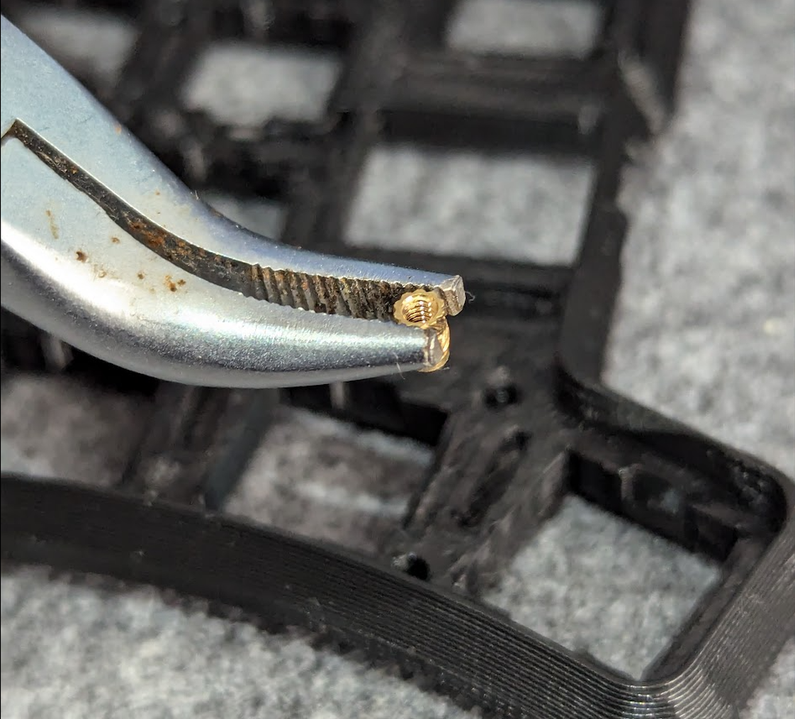
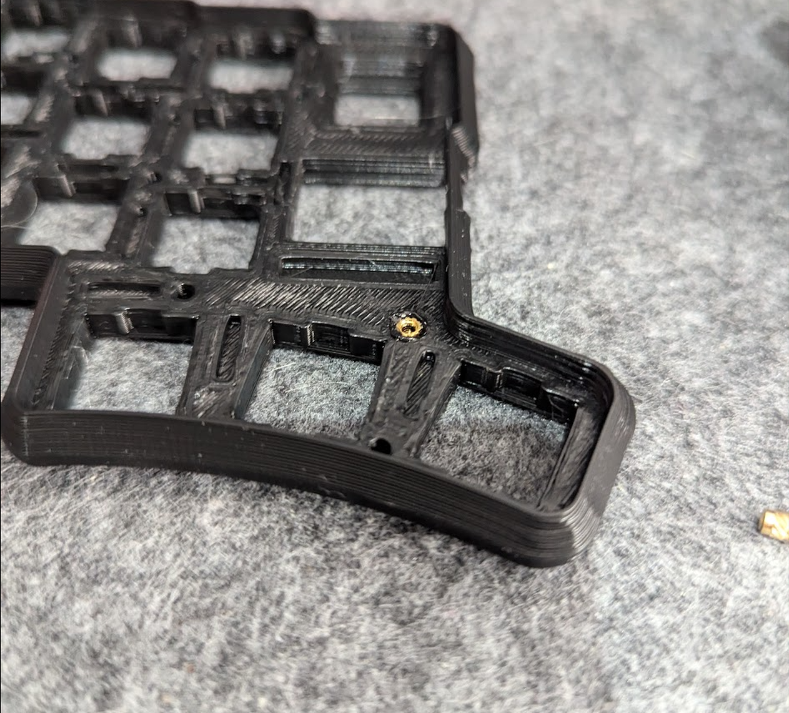
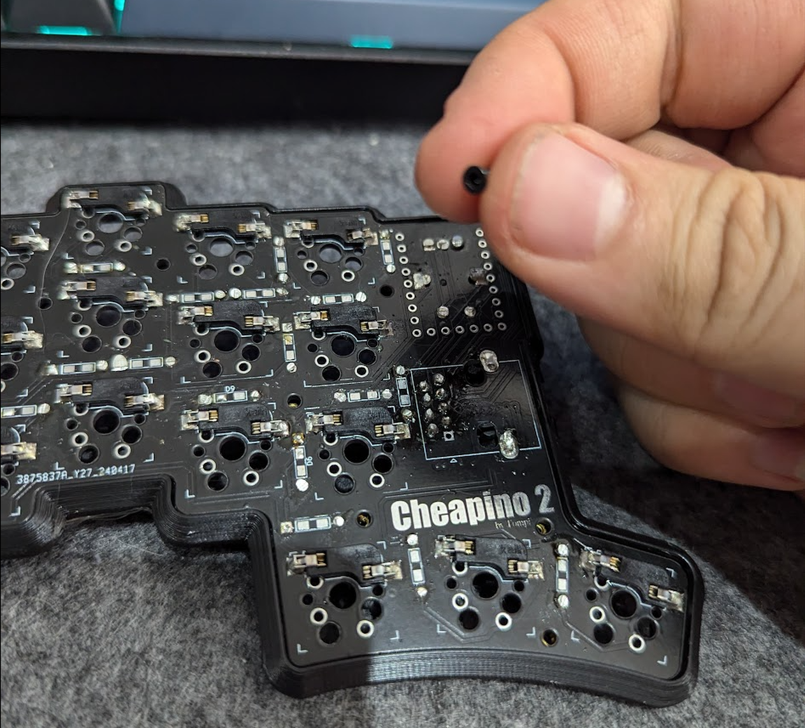
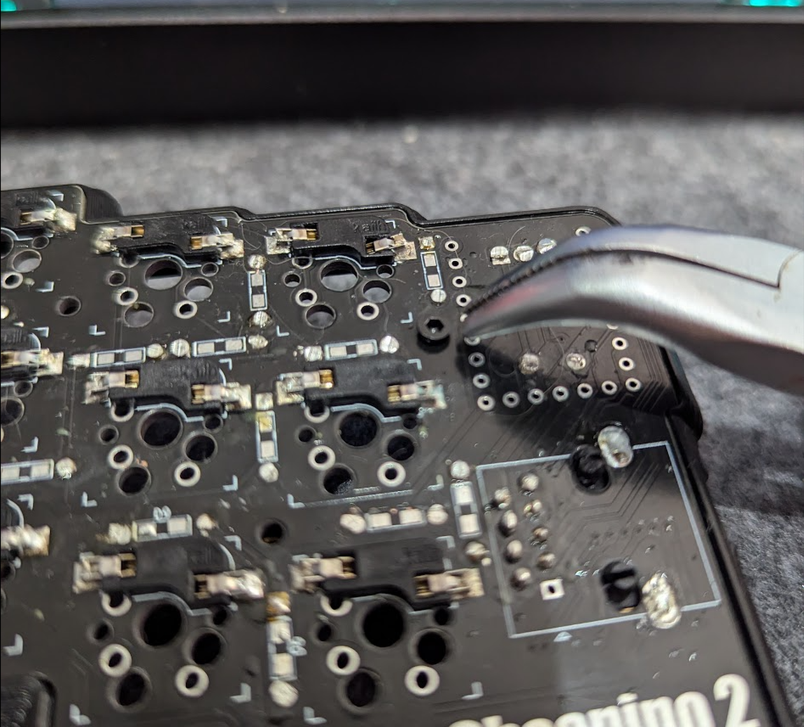

V2 Case build guide
===================

This is a case I made, very compact, almost no empty space inside:
https://www.thingiverse.com/thing:6661648

Lots of pictures here: https://imgur.com/a/cheapino-2-case-R4ialST

To build it, you need to 3D print all 4 parts in the thingiverse link above.
If you want to tweak something, check the readme in the case-folder in this repo.

I printed this with 100% infill, and got feedback from others testing with other
values, and the 100% infill makes a difference in sound and feel(more compact, less ping).

You will also need 18 m2 heat brass insert nuts, 4mm long and 3mm outer diameter is optimal,
along with 18 m2 screws, around 5mm long, preferably counter sunk head, since the case
has counter sunk cutouts for the head.

These are the items I ordered for my builds:
https://aliexpress.com/item/1005006939497014.html (M2X5 (200pcs) $2.61)
https://aliexpress.com/item/1005006071488810.html (M2xL4xOD3 (50PCS) $2.70)

If you are interested in tenting the keyboard, you might want to order
some adhesive mag-safe rings:
https://aliexpress.com/item/1005006256285165.html

Which you can use with stands to get any angle that suits you:
https://aliexpress.com/item/1005006349287185.html

Im also planning to design some snap-on feet, and there are compartments
in the case for these, for future use:
https://aliexpress.com/item/1005001658853871.html

Once you printed all 4 parts of the case, you need to install the m2 heat inserts.
You can insert them by using your soldering iron to heat them while applying gentle 
pressure and maybe press last 10% with a flat surface, to get a nice finish.
Overly complicated explanation here:
https://hackaday.com/2019/02/28/threading-3d-printed-parts-how-to-use-heat-set-inserts/

Try to make sure all of your components are soldered flush to the pcb so they dont obstruct the case.
Place the bottom of the case on the pcb, and check that it fits flush to the pcb, otherwise you
might need to redo a component if it sticks out and prevents the bottom fit.
(Optionally, if you have magnets, place them in the cutouts before attaching the two bottom plates)

Next place the bottom into the top case, and attach it using 9 M2 screws per side.

Lastly remove adhesives for magsafe stickers, if you have them, and attach it carefully so you
dont obstruct any screws(otherwise you will have problems dismantling the case in the future).

## Case assembly
I need to preface this part, my printer which is a second hand ender 5, isn't calibrated properly, and i'm too lazy to invest the time to do it.
With that out of the way, I printed tompi's case, and got some new keycaps, a magnetic USB cable and a nicer patch lead to connect the halves.

#### Fitting the threaded inserts
After printing the case top, you will see these holes on the inside.

I found using a pair of curved needle-nose pliers made this quite easy to do.
- Line up the threaded insert with pliers
- Push the insert into the hole with a hot soldering iron
- Remove the soldering iron when the insert is level with the top of the hole (sometimes the insert will be stuck on the iron, in this case, use the pliers to hold the insert in place when you remove the iron)

Repeat for all "holes"

#### Fitting the case
Remove all the switches

Place the PCB inside the case

Flip it upside down   
**Note:** i didn't use the case bottom, but if you did, set it in place at this point.
insert the screws through the case bottom if youre using it, if not, just screw them in through the screw holes in the PCB.

Once this is done, flip back over and refit the switches and keycaps. As i mentioned, my printer isn't callibrated very well, so pushing the switches in took a LOT of force, but they did go in, and as a bonus, this means my switches have zero wobble.
It looked like this once i got all the switches and keycaps installed.

Instead of using the case bottom, i just added some 3M dots as cusioning, and they work perfectly well for me.
 

