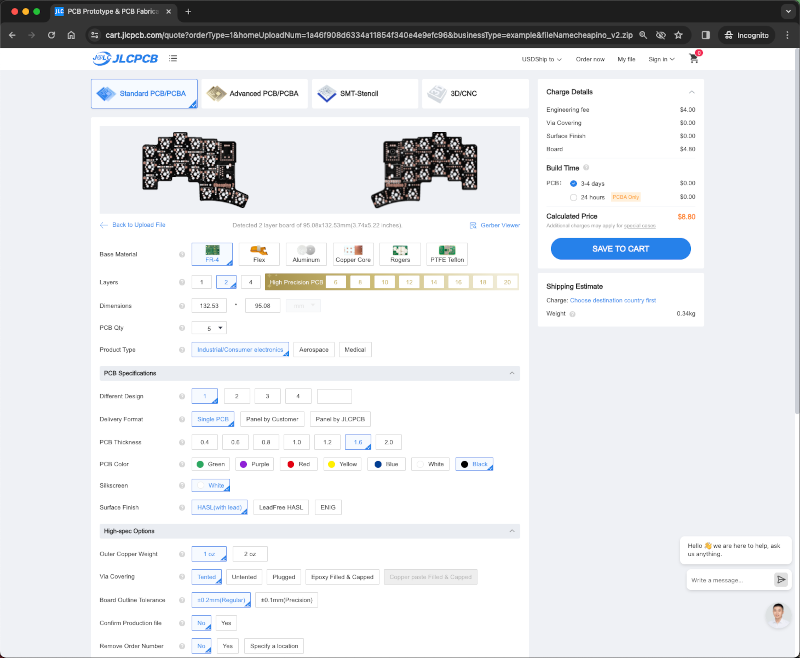
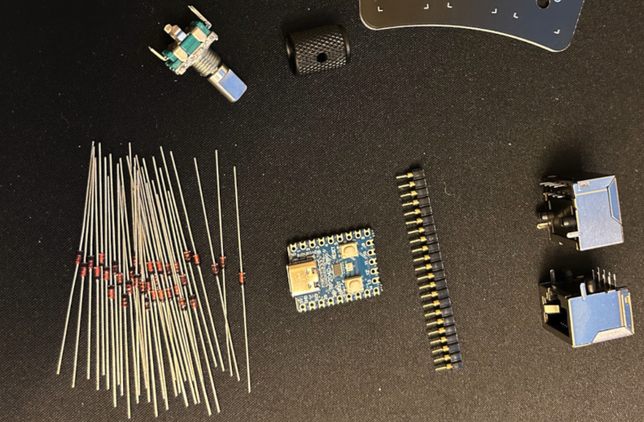
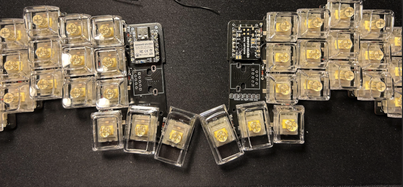

# Cheapino components buying guide

## Introduction

The parts list(BOM) is the same for both v1 and v2, except for optional hotswap sockets for v2.
You need to buy from at least 2 parties, the PCB needs
to be custom made, the other parts can be ordered from any electronics supplier.

I have a small amount of v2 PCBs, and components, so feel free to drop me
a mail and ask for a quote, I might be able to send you a kit pretty cheap.
Its difficult to beat the chinese though, especially with shipping from Norway ;)

### The PCB

From my research, nothing beats jlcpcb.com on price(pcbway.com is close, but not quite there...).
You will need to upload the "gerbers" on the frontpage of jlcpcb.

* v1: https://github.com/tompi/cheapino/releases/download/v1.0/gerber.zip
* v2: https://github.com/tompi/cheapino/releases/download/v2.0/cheapino_v2_gerber.zip

You should see a thumbnail of it afterwards. Defaults are fine, but you might consider
lead free HASL(ca 1usd more expensive).

You probably want to consider a different color than the default green.
This is completely up to you, there is no price difference, the only thing
is that green is guaranteed to take only 24 hours to produce, while
others might take up to 3-4 days(which is nothing compared to AliExpress shipping times...)

Take care when it comes to shipping, there is a lot of options, and price
and time varies a lot(they always get there in the end though, so I tend
to choose the cheapest option...).

Please note that the PCB is reversible so you'll only get 5 of the same PCB in the package.

### The components

You need switches, keycaps, rj45 sockets, diodes and an rp2040-zero mcu.
The encoder and mcu sockets are optional(to be honest, I dont use the encoder
much, I know other people do, and it doesnt cost much extra).

For a hotswap build(meaning you can replace switches without soldering),
you need to order hotswap sockets, and you should probably use a plate, or a case,
to keep swtiches from falling out accidentally. The old v1 plate will do, but
several people(including myself) are working on plates and cases. Stay tuned.

The white lines on the PCB are where components will go. You should cross-reference
this blueprint with images and dimensions of advertised parts. The ones linked below
should be fine, but it's good to double check to avoid the pain of re-ordering parts. 
You can check the PCB blueprint with software, and by skipping ahead to the build guide. 

Buying from AliExpress is a bit of an art in itself. You need to do your
due diligence and check reviews and ratings of the store. If an item is priced
significantly lower than other places, without many sales or reviews, you
should be suspicious. AliExpress is just the middleman, and there are lots
of unserious actors.

For my own part, I have good experience with the new "Choice" options,
where you get free shipping on > 10usd orders. A few times I ordered
none choice-options and had problems with VOEC clearance, so I had to pay
extra taxes and a clearance fee, and it took way longer to ship.

These are the items I usually order:

| Part                | Quantity for 1 keyboard | Quantity in sold package | Notes        |Price (USD)  | Url |
| --------------------|------------------------:|-------------------------:|--------------|----:|-----|
| RP2040-Zero     |                        1|                         1|Choose the version without header(The pre-soldered headers can be a very tight fit...), and buy some sockets, its worth it!     |1.78 | https://www.aliexpress.com/item/1005004281549886.html |
| RJ45 Sockets (8P8C) |                        2|                        10|Make sure the pins are at the back of the socket (see PCB blueprint). |2.37 | https://www.aliexpress.com/item/32902228456.html |
| Diodes 1N4148   |                       42|                       50|You can also ordes smb if you want. Smaller but more difficult to solder: https://www.aliexpress.com/item/4000685043735.html              |0.74 | https://www.aliexpress.com/item/1005006245109375.html |
| EC11 Encoder        |                        1|                         5|              |2.68 | https://www.aliexpress.com/item/1005004907970664.html |
| Encoder knob    |                        1|                         5| A much better looking(and more expensive) knob: https://www.aliexpress.com/item/32749281108.html              |1.35 | https://www.aliexpress.com/item/1005004907970664.html |

As you can see, it really makes sense to just order 2 mcu's at once, to be able to build 2 keyboards.

These are the items I really recommend in addition:

| Part                | Quantity for 1 keyboard | Quantity in sold package | Notes |Price (USD)  | Url |
| --------------------|------------------------:|-------------------------:|------|-------:|-----|
| Sockets for MCU |                        1|                          5|   Choose the single row silver plated(cheapest...). Socketing has multiple advantages: you can reuse mcu for another build, or more   importantly replace it easily if it breaks. It also makes it easier to debug a faulty build.  |   2.01 | https://www.aliexpress.com/item/4001122376295.html |
| Silicone bumpers|                      ~20|                        100| 5 mm wide and 2 mm high is fine. If you know you will only use the keyboard on a mat or with a case, you might not need this, otherwise you   want them.     |   1.65 | https://www.aliexpress.com/item/1005005592713123.html |
| Hotswap sockets |                       36|                         40| You want the mx one, NOT the low profile | 3.04 | https://www.aliexpress.com/item/1005006610157756.html |

Its very easy to underestimate the advantage of socketing the MCU. Think of it as an insurance. Desoldering the the pin-headers that come with the mcu is VERY difficult... If something goes wrong, you might need to switch the mcu(if you fry it because of a bridge between gnd and vcc, or if it is defect from the factory...), or if the pcb is damaged, you could re-use the mcu in a new pcb if you manage to remove it... Also, when things are not working, its very easy to tell if the
problem is on the pcb or the mcu, by removing the mcu...

These are some nifty items I really like, but not necessary:
(Warning: some cheap magnetic usb c cables might fry your rp2040-zero... Check this issue for more info: https://github.com/tompi/cheapino/issues/130 )

| Part                    | Quantity for 1 keyboard | Quantity in sold package | Notes |Price (USD)  | Url |
| ------------------------|------------------------:|-------------------------:|-------|------:|-----|
| Flexible cat6 cable |                        1|                         1|    0.5m is perfect in my experience. Regular network cables are often very long and rigid.     |0.84 | https://www.aliexpress.com/item/1005002518783703.html |
| Magnetic USB cable  |                        1|                         1| You can buy any brand, but make sure its not charging only, check the picture for 4+ contact points. I use these for all my boards, the usb   port of the mcu is the first thing that will wear out if you dont use this. Make sure you get both cable+plug, and chose the usb c type. NB: These magnetic cables are not made to the usb-c spec, use at your own risk:
https://www.reddit.com/r/UsbCHardware/comments/motlhn/magnetic_usbc_cables_are_not_recommended/ (I have not heard of any problems personally, and I suspect its more of a higher voltage problem, but not my field of expertise...)        |2.22 | https://www.aliexpress.com/item/1005003776565766.html |
| Carrying case       |                        1|                         1| This case fits pretty snugly: 15x11x4,5cm (might depress switches, choose 17x12x5 for more space). Nice to have if you are travelling!        |2.12 | https://www.aliexpress.com/item/1005006381237074.html |

These cables are really good looking: https://www.aliexpress.com/item/1005006190874241.html
Pictures of them in action here: https://www.reddit.com/r/ErgoMechKeyboards/comments/1bz4lse/my_first_build_the_cheapino_v2/
NB: Some high-end(USB3.2) cables in combination with e.g. Mac M1 causes issues. For the cheapino, a cheap usb cable works best ;) Check the trouble shooting guide for more info.

## Switches

You will need switches, and people are writing insanely long texts about the topic, eg https://www.theremingoat.com/ .
I often work in an open space with other people, so I like to not make too much noise and tend to choose linear or silent tactiles,
as opposed to people who enjoy annoying others and choose clicky switches. (ok, im writing this text on my cheapino v1 with recycled
blue clickys, and they ARE pleasant, but this is at home, and my wife is using sound insulating earbuds atm...)

I have ordered these, and liked them: https://www.aliexpress.com/item/1005006270820565.html
(Just tried the peach and silent cream, but have an order for the lemon ones in as well...)

If you want cheap,

You will need 36 switches per keyboard.
** NB: buy 5 pin switches!** One of the most important improvements of v2 of the Cheapino
is support for 5 pin switches, which aligns switches easily even without a plate.

## Keycaps

Keycaps are also something you can spend huge amounts of time and money on.
Want a keycap with your favorite Pokemon molded in, no problem, they are just 40usd per keycap: https://hirosarts.com/custom-pokemon-keycap/
This guy got his keycaps after a small waiting period of 3+ years...: https://www.reddit.com/r/MechanicalKeyboards/comments/1c6zewk/about_3_years_2_months_and_6_days_later/

Im pretty happy with xda profiles from AliExpress. One set is usually enough for 2-3 Cheapinos...

Why not go all in an order a clear keyset, you will need to touch type anyway, so no need for
labels. You will blow your colleagues minds with this set: https://www.aliexpress.com/item/1005004761931363.html
I got the transparent one, and there was enough keys for 3 complete keyboards.

This is a v2 prototype with milky yellow switches that im testing wireless with.

## Tools

Here are the tools you will need:

- Soldering iron (I have a KSGER T12 one from AliExpress, paid ~25usd I think, super happy with it!)
- Solder
- Diagonal cutters

Nice to have:

- Safety goggles(you dont want solder or cut off diode legs in your eyes)
- Flux
- Solder wick(for when you applied too much solder: apply some flux to it first)
- Cleaning ball for solder iron(made from copper wire) and sponge: for tip maintenance
- Helping hands: to hold the PCB up from the desk while soldering diodes

Send me any tips you have!

