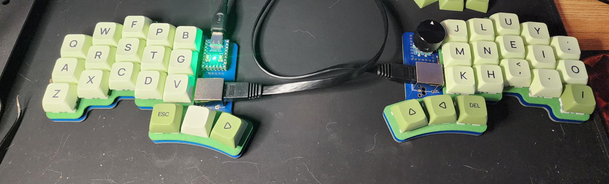
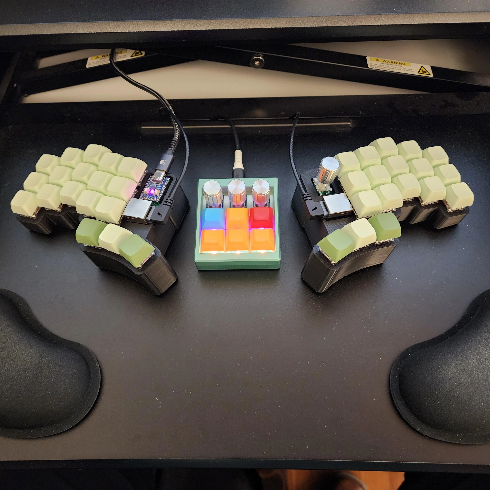
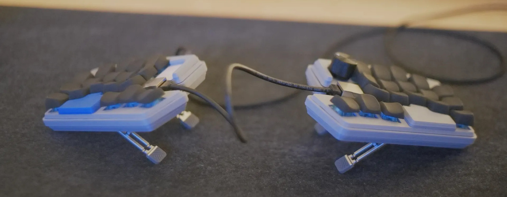
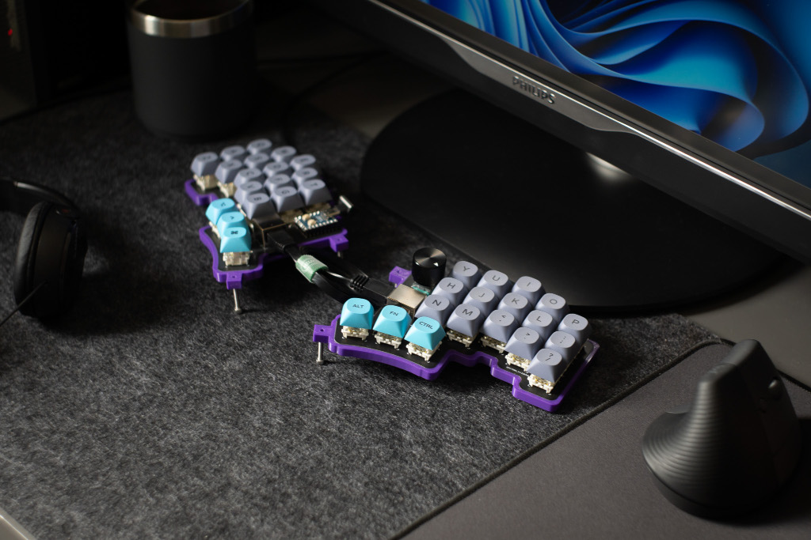

Plates and cases
================

[This simple plate](../plates/plate.stl) works for both v1 and v2.
It has no support or screw inserts, so not ideal for hotswap
builds, but does the job.

## V2

This is the basically the same plate with a few supports
placed where the mounting holes are. I have not tested to
actually screw this on, Im just using it without screws:
[left plate with supports](../plates/cheapino-plate-left.stl)
[right plate with supports](../plates/cheapino-plate-right.stl)

This is a case I made, very compact, almost no empty space inside:
https://www.thingiverse.com/thing:6661648

Lots of pictures here: https://imgur.com/a/cheapino-2-case-R4ialST

[A bit unfinished build guide for this case here.](case_buildguide.md)

TheMadClover made 2 really nice looking case options, one tented,
and one flat, check them out here:
https://www.printables.com/model/879047-two-case-designs-for-cheapinov2-split-ergo-keyboar

## V1

This is a VERY nice case with built-in support for tenting
and a travel solution:
https://www.printables.com/model/835134-cheapino-split-keyboard-case

This is a case for v1 with a simple tenting solution:
https://www.printables.com/model/541536-cheapino-case-with-basic-tenting

