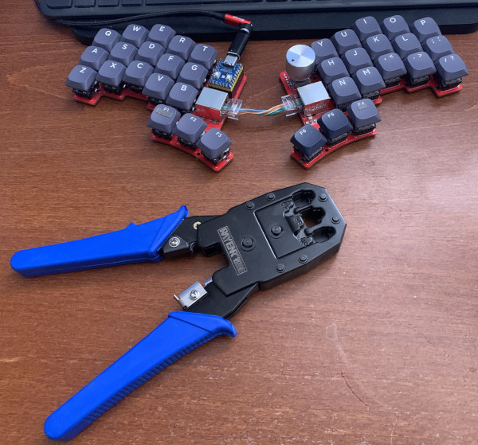

Miscellanous tips and tricks
============================

## Crimper

Can't find that 13.37 cm long dark olive green network cable that would go
perfectly with your Rain Forest GMMK keycaps? Follow @jinchoung's tip and get a
cable crimper:

## LED layer indication

Want to indicate active layer using the rp2040-Zero built-in LED?
I tried this and found it a bit annoying... If you want to try, there
is some code here: https://github.com/tompi/qmk_firmware/blob/67aa22818e2be422abdb32fc918c2b6757137a4e/keyboards/cheapino/cheapino.c#L45
Follow the firmware guide for compiling, and uncomment the layer code above.
