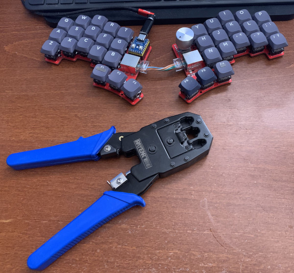
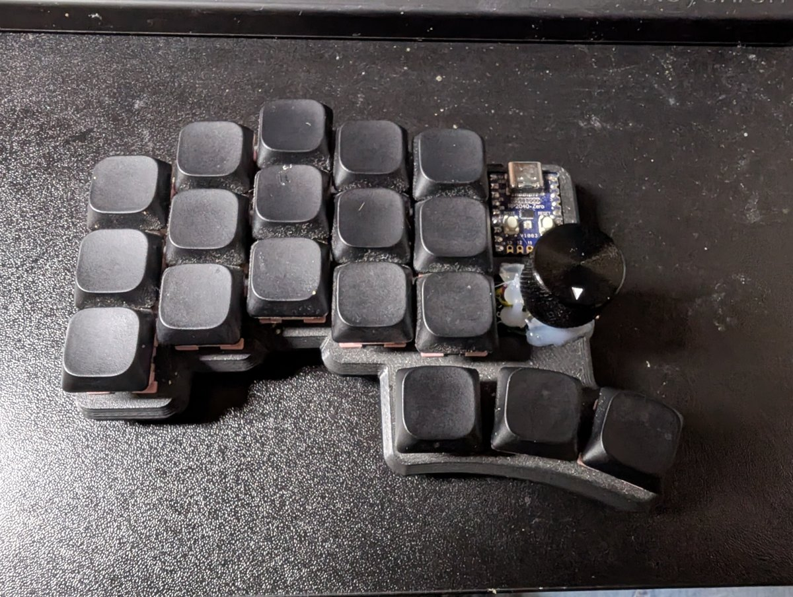
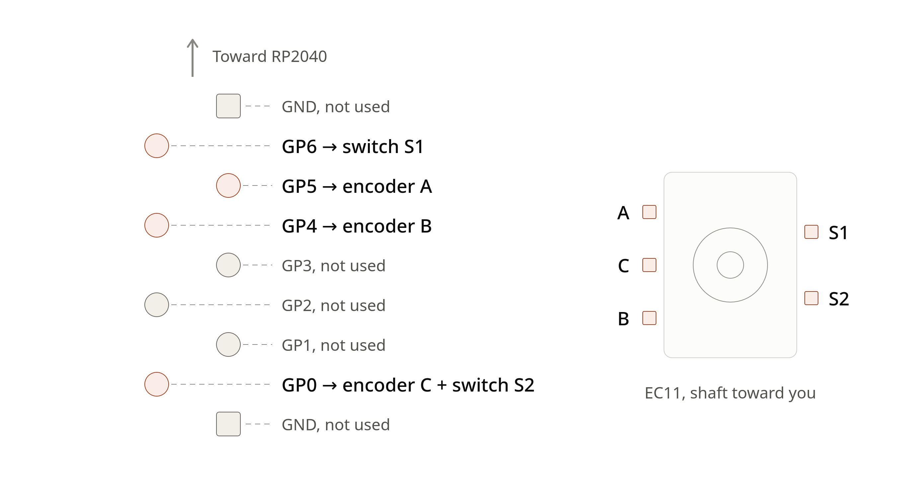

Miscellaneous tips and tricks
============================

## First-time builder tips

Building a Cheapino can be challenging for beginners. Here are some key tips based on real user experiences:

### Soldering technique
- **Always use flux** - it's not optional for clean joints, especially on the tiny MCU pins
- Heat the joint, not the solder - touch both the component pin and pad with your iron
- For the MCU: Use a fine tip, work slowly, and clean your iron frequently
- If you make a mistake, don't panic - use solder wick with flux to clean up

### Build order considerations
- Some builders recommend installing hotswap sockets first (if using them) since they're easier to access
- Test fit components before final soldering when possible
- Socket the MCU - it's much easier to replace if needed than desoldering headers

### Desoldering tips
- **Prevention is better than cure** - double-check orientation before soldering
- For desoldering small components: Add fresh solder first (with flux), then use solder wick
- For through-hole components: Use a solder sucker from one side while heating from the other
- **Be gentle** - excessive force can damage PCB traces
- If a trace gets damaged, thin wire can often bridge the connection

### Equipment recommendations
- KSGER T12 soldering iron with temperature control is excellent for beginners (~$25)
- Use chisel tips (T12-K, T12-BC2) for most work, fine conical (T12-I) only for MCU pins
- Good lighting and magnification help immensely
- Take breaks - fatigue leads to mistakes

## Crimper

Can't find that 13.37 cm long dark olive green network cable that would go
perfectly with your Rain Forest GMMK keycaps? Follow @jinchoung's tip and get a
cable crimper:

## LED layer indication

Want to indicate active layer using the rp2040-Zero built-in LED?
I tried this and found it a bit annoying... If you want to try, there
is some code here: https://github.com/tompi/qmk_firmware/blob/67aa22818e2be422abdb32fc918c2b6757137a4e/keyboards/cheapino/cheapino.c#L45
Follow the firmware guide for compiling, and uncomment the layer code above.

## Use the spare PCB as a gaming pad with a rotary encoder

PCB orders come in fives, so you'll end up with a spare half. I turned mine into a
one-handed gaming pad and wired an EC11 rotary encoder straight into the unused
RJ45 pads to use as a quick layer switcher.

The stock firmware already reads the encoder over these lines, so no firmware
changes are needed. Just wire it up and map it in Vial.

Wiring, with the RJ45 pads viewed from the top and the RP2040 above them:

| RJ45 pad | EC11 pin |
|----------|----------|
| GP6      | S1 (switch) |
| GP5      | A |
| GP4      | B |
| GP0      | C (common) and S2 (switch) |

GND, GP1, GP2 and GP3 aren't used. C and S2 share GP0, so bridge them on the
encoder side and run a single wire.

Tips:
- If the encoder turns the wrong way, just swap the clockwise/counter-clockwise
  keycodes in Vial rather than rewiring A and B.
- The EC11 is smaller than the RJ45 jack, so it fits in the same spot without
  modifying the case. A blob of hot glue holds the encoder and wires in place.
- Pairs really well with the [LED layer indication](#led-layer-indication) tip
  above. I cycle through 4 layers with the encoder and use a different LED colour
  per layer (red, green, blue, yellow) so you can tell at a glance where you are.
