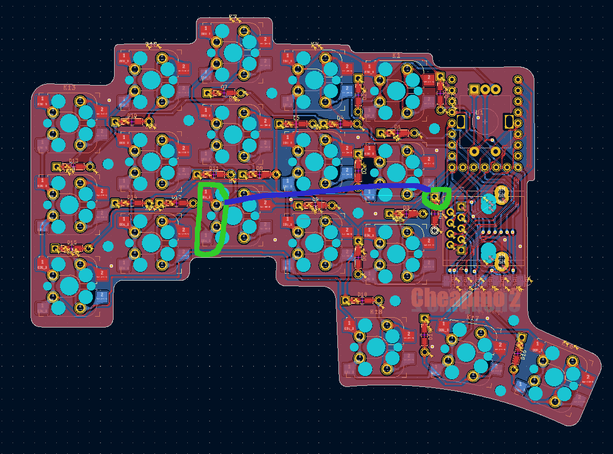
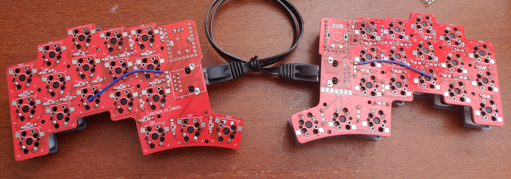

# Cheapino troubleshooting

## Single switches are not working

Usually, this is caused by either not soldering the diode, soldering the diode in the wrong direction, or in some very rare cases a malfunctioning diode or switch.

To rule out the switch: try to short the two pins of the switch with a wire.
If this fires the key, you got a bad switch: desolder it and put in a new one.
(Get yourself an "engineer ss02", its amazing for desoldering work...)

If it doesnt, try to short the circuit "before" the diode. If this works the diode is either bad or in the wrong direction. Desolder and realign or switch it.

## Entire rows or entire columns are not working

This could be caused by several things:

### Bad connection on MCU

Check that the pins of your rp2040-zero are all soldered ok. There should not be a "blob" of solder, it should look like a volcano. Retouch any strange looking soldering points on the MCU.

### Shorts on the MCU or the RJ45 socket

Check your soldering on both MCU and the RJ45 sockets. If there are any shorts, try sucking up some solder with e.g. some solder wick or your solder sucker.

### Ethernet crossover cable

Not all ethernet cables are the same... There are different variants more or less rare, for different purposes. The most common which will create problems for the cheapino is the crossover cable: https://en.wikipedia.org/wiki/Ethernet_crossover_cable

Try different cables, if one is working fine, this is your issue. 

## Suddenly my cheapino outputs A LOT of random characters

This will happen with some cheap encoders, they may not de-tent properly, and get stuck in a position which creates problems for the firmware. The solution to this is just to turn the encoder a little, and it should go away...

## I Ordered a beta of the version 2 and the 2 middle columns on each side are not working

This is my fault... You need to run a bodge wire between 2 points on each half:
 
 
