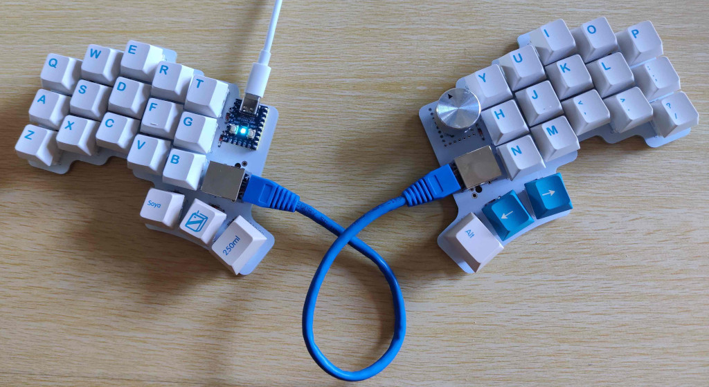
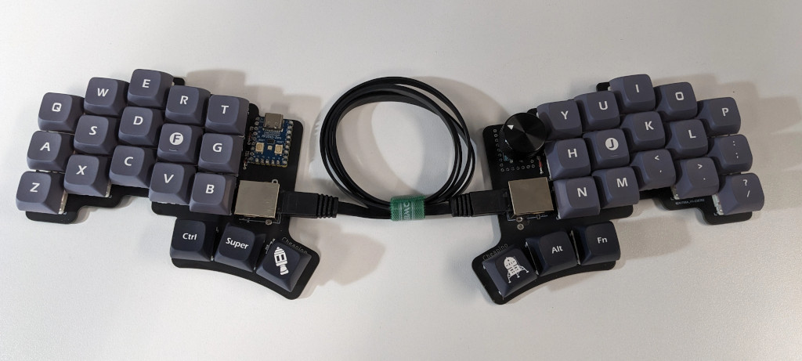
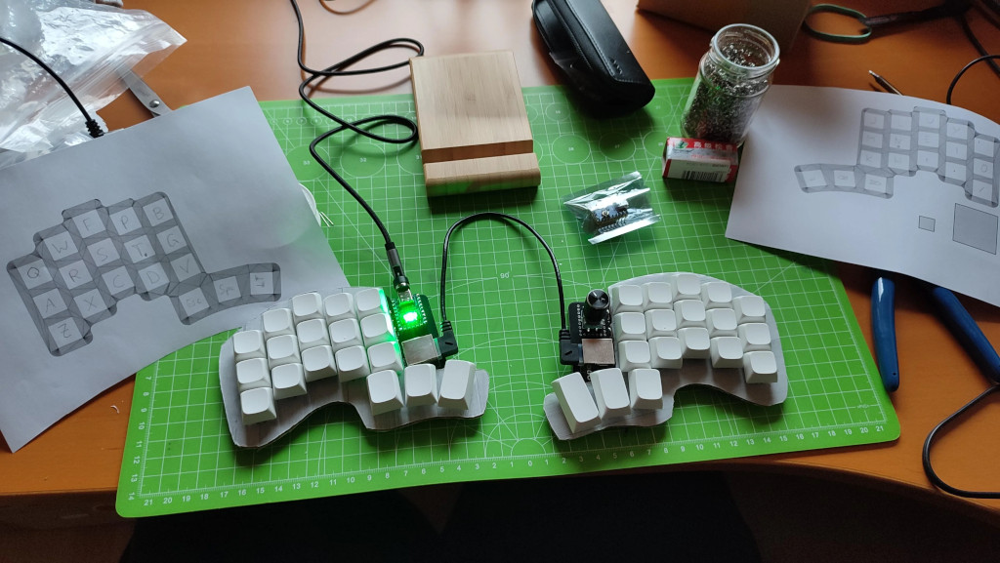

Cheapino V1 (Obsolete)
========

The V1 and V2 are not that different, they have the same key layout, but V2 has a lot of minor improvements, so I suggest building that!

Here are some V1 images:

https://www.reddit.com/r/ErgoMechKeyboards/comments/12xg4u7/built_the_cheapino/

https://www.reddit.com/r/ErgoMechKeyboards/comments/13c274r/cheapino_build/

https://discuss.tchncs.de/post/410101

https://discuss.tchncs.de/post/852362

https://lemmy.world/post/2080485

https://lemmy.world/post/2832967

https://www.reddit.com/r/ErgoMechKeyboards/comments/18i5jpu/first_build_cheapino/

https://www.reddit.com/r/ErgoMechKeyboards/comments/18zb3l1/first_build_finally_cheapino/

https://lemmy.world/post/2480447

Printable file  for the case here: https://www.printables.com/model/541536-cheapino-case-with-basic-tenting

Probably the cheapest tenting solution: https://www.reddit.com/r/ErgoMechKeyboards/comments/16s3yb2/cheapino/

@keyboard-magpie made a plate which will help position the switches: [plate.stl](../plates/v1_plate.stl)

@ggppjj made some useful modifications to miryoku and enabled LED for that as well here: https://github.com/ggppjj/qmk_firmware/releases

Drawbacks:

* V1 only: Without a plate, its pretty difficult to solder swithes straight. I made a small helper "fork" to hold each column in place when soldering. Check the build guide for a link to a really good 3D printed fork.
* RJ45 cables are a bit rigid, so they do not lay down on the table nicely like audio cables.
* There is no official qmk support, you need to compile from my branch manually... Keymap can be edited in qmk configurator though.

