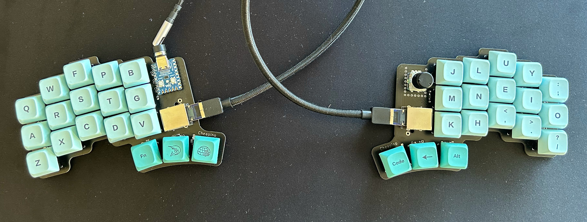
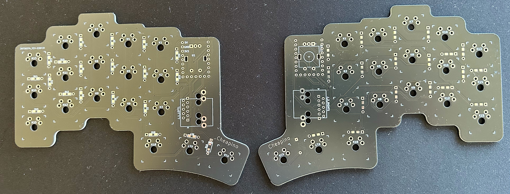

Cheapino
========

Probably one of the cheapest split keyboards you can build.

This is the result of really enjoying building keyboards, but not wanting to spend that much money on it. The pcb is reversible, connected using rj45, and utilizes a japanese duplex matrix, so only one mcu is needed(in fact it only uses 6 of the rj45 wires to support 18 switches and an encoder on the right side).

A qmk branch with support is located here: 
https://github.com/tompi/qmk_firmware/tree/cheapino

To build it, you need:

* PCBs (ca 20$ for 5 at JLCPCB)
* RP2040-Zero (ca 4$ at AliExpress)
* 38 diodes(both smb and throug hole are supported, ca 2$ for 100 at Ali)
* 2 rj45 connector (ca 3.5$ for 10 at Ali)
* 1 ec11 rotary encoder(optional, 2$ for 2 at Ali)

All prices are including shipping to Norway.
Pick up a used mechanical board for ~10$ and harvest switches and keycaps, and you have enough for more than 2 sets.
You also need an rj45 cable and an usb c, but come on, these should be laying around anyway, right?
So total for 2 sets should be less than 50$, meaning 25$ for one. Pretty sweet deal?

If you are wondering if this is actually usable, Im writing this on it, and Im pretty happy with it. 

Drawbacks:

* Without a plate, its pretty difficult to solder swithes straight. I made a small helper "fork" to hold each column in place when soldering.
* RJ45 cables are a bit rigid, so they do not lay down on the table nicely like audio cables.
* There is no official qmk support, you need to compile from my branch manually... Keymap can be edited in qmk configurator though.

