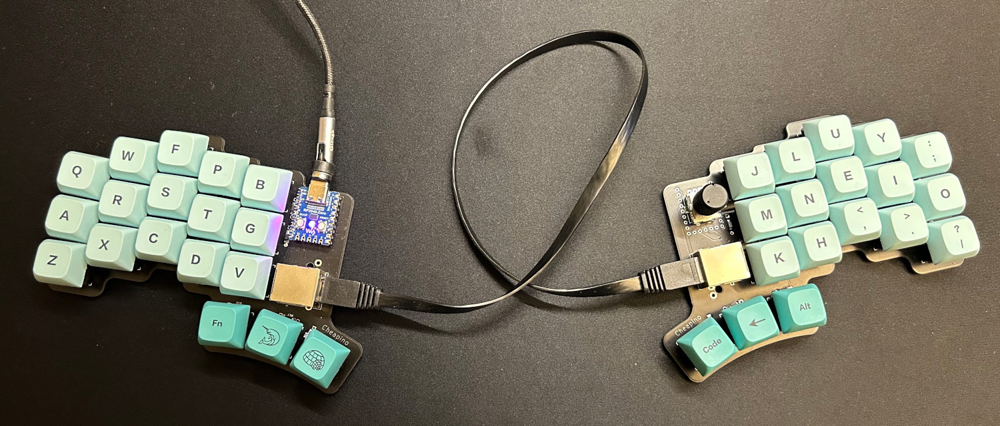
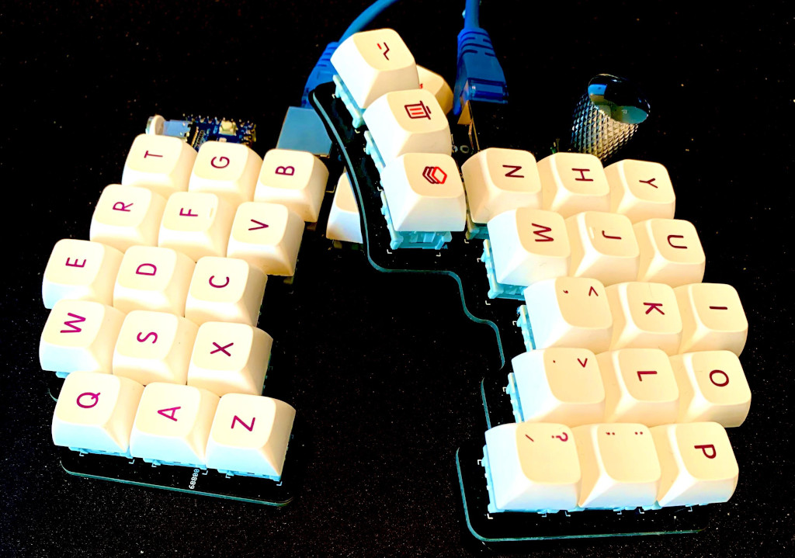
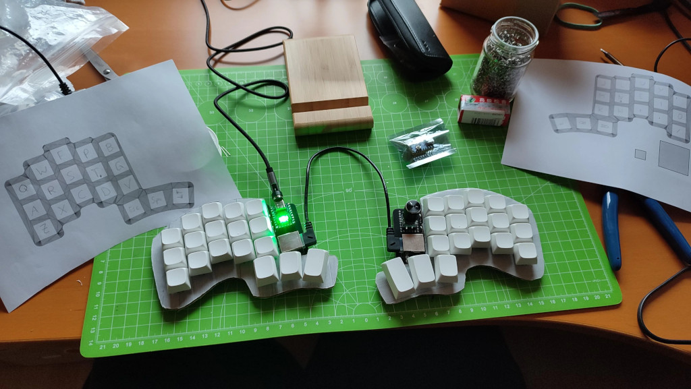
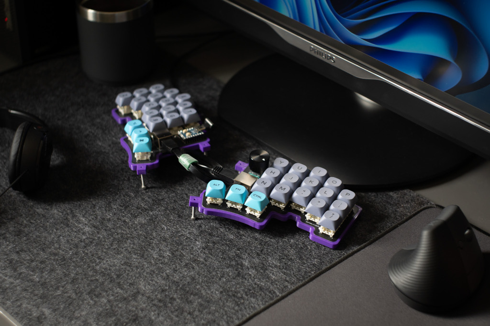
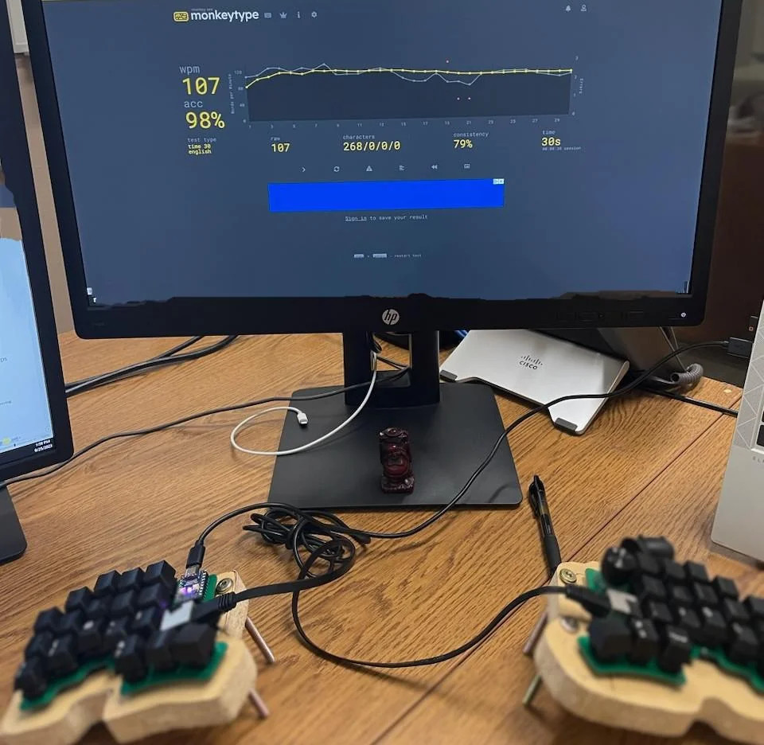

Cheapino
========

Probably one of the cheapest split keyboards you can build.

N.B.: Version 2 is out(check releases), but have not updated photos
or build guides. I recommend you build v2 instead of v1.

This is the result of really enjoying building keyboards, 
but not wanting to spend that much money on it. 
The pcb is reversible, connected using rj45, 
and utilizes a japanese duplex matrix, so only one
mcu is needed(in fact it only uses 7 of the rj45 wires to 
support 18 switches and an encoder on the right side).

Checkout the [build guide](doc/buildguide_v1.md) for more details and pictures.

Checkout the [troubleshooting guide](doc/troubleshooting.md) if your Cheapino does not work.

See the [firmware guide](doc/firmware.md) for how to build and customize keyboard firmware.
News: both v1 and v2 supports vial, checkout the cheapino_vial.uf2 in the releases.

If you just want to flash [Miryoku](https://github.com/manna-harbour/miryoku) 
on your Cheapino, download the [uf2 file from the release section](https://github.com/tompi/cheapino/releases/download/v1.0/cheapino_manna-harbour_miryoku.uf2), 
put the rp2040-zero in dfu mode by holding boot while pressing reset, then return,
then you should get a new usb drive which you can just copy the uf2 file to.

A qmk branch with support is located here: 
https://github.com/tompi/qmk_firmware/tree/cheapino

If you are wondering if this is actually usable, Im writing this on it, and Im pretty happy with it. 
My son is also using his at his work and claims its very usable.

These are a few other people that built it:

https://www.reddit.com/r/ErgoMechKeyboards/comments/12xg4u7/built_the_cheapino/

https://www.reddit.com/r/ErgoMechKeyboards/comments/13c274r/cheapino_build/

https://discuss.tchncs.de/post/410101

https://discuss.tchncs.de/post/852362

https://lemmy.world/post/2080485

https://lemmy.world/post/2832967

https://www.reddit.com/r/ErgoMechKeyboards/comments/18i5jpu/first_build_cheapino/

https://www.reddit.com/r/ErgoMechKeyboards/comments/18zb3l1/first_build_finally_cheapino/

https://lemmy.world/post/2480447

Printable file  for the case here: https://www.printables.com/model/541536-cheapino-case-with-basic-tenting

Probably the cheapest tenting solution: https://www.reddit.com/r/ErgoMechKeyboards/comments/16s3yb2/cheapino/

@keyboard-magpie made a plate which will help position the switches: [plate.stl](plate.stl)

@ggppjj made some useful modifications to miryoku and enabled LED for that as well here: https://github.com/ggppjj/qmk_firmware/releases

Drawbacks:

* Without a plate, its pretty difficult to solder swithes straight. I made a small helper "fork" to hold each column in place when soldering. Check the build guide for a link to a really good 3D printed fork.
* RJ45 cables are a bit rigid, so they do not lay down on the table nicely like audio cables.
* There is no official qmk support, you need to compile from my branch manually... Keymap can be edited in qmk configurator though.

