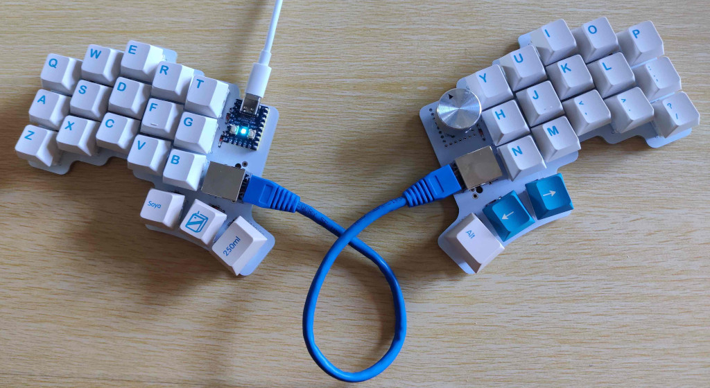

Cheapino
========

Probably one of the cheapest split keyboards you can build.

This is the result of really enjoying building keyboards, 
but not wanting to spend that much money on it. 
The pcb is reversible, connected using rj45, 
and utilizes a japanese duplex matrix, so only one
mcu is needed(in fact it only uses 7 of the rj45 wires to 
support 18 switches and an encoder on the right side).

Checkout the [build guide](doc/buildguide_v1.md) for more details and pictures.

A qmk branch with support is located here: 
https://github.com/tompi/qmk_firmware/tree/cheapino

If you are wondering if this is actually usable, Im writing this on it, and Im pretty happy with it. 
My son is also using his at his work and claims its very usable.

I know at least two other persons that built it:

https://www.reddit.com/r/ErgoMechKeyboards/comments/12xg4u7/built_the_cheapino/

https://www.reddit.com/r/ErgoMechKeyboards/comments/13c274r/cheapino_build/

https://discuss.tchncs.de/post/410101

https://discuss.tchncs.de/post/852362

Drawbacks:

* Without a plate, its pretty difficult to solder swithes straight. I made a small helper "fork" to hold each column in place when soldering.
* RJ45 cables are a bit rigid, so they do not lay down on the table nicely like audio cables.
* There is no official qmk support, you need to compile from my branch manually... Keymap can be edited in qmk configurator though.

