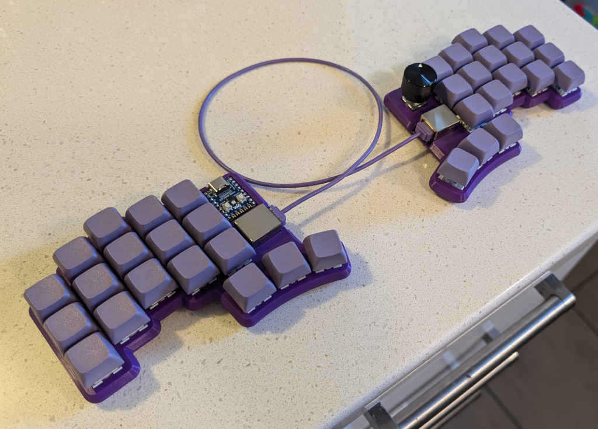
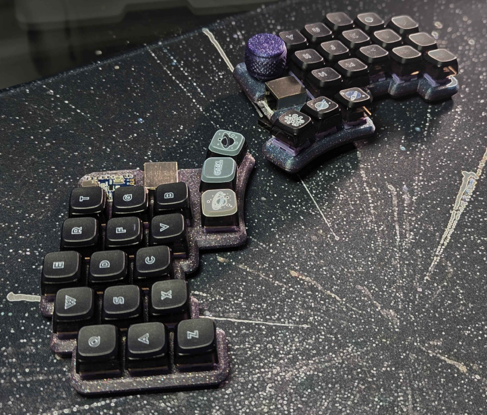
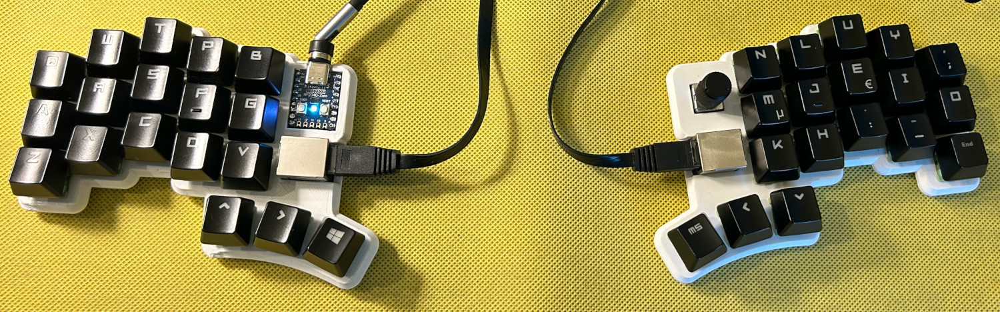
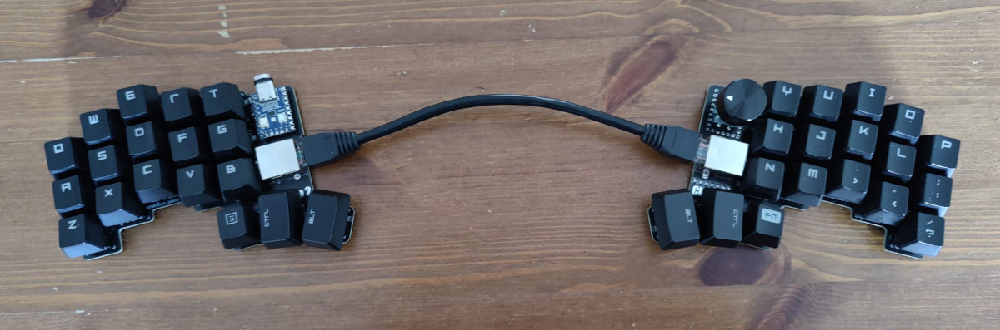
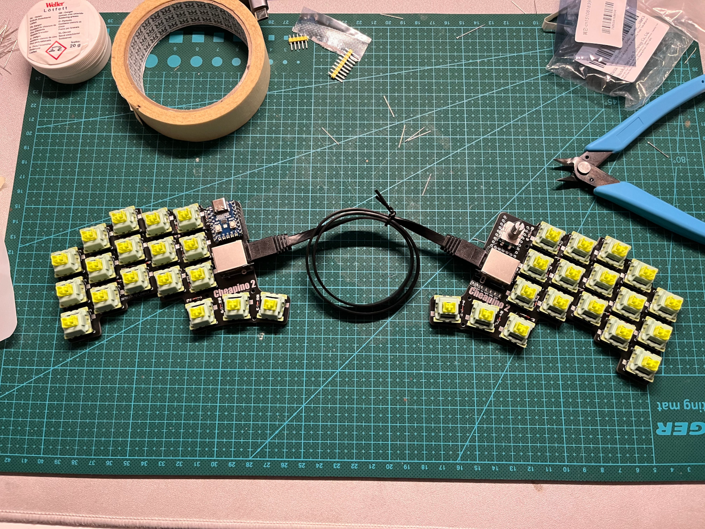
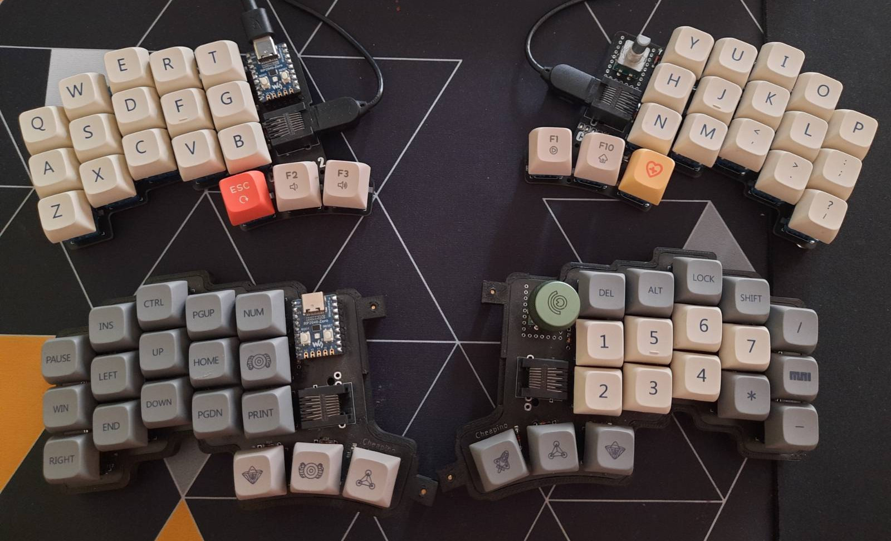
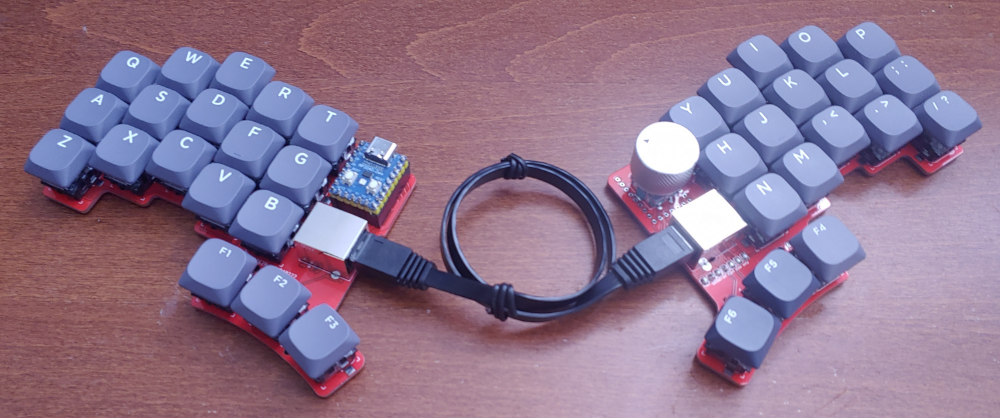

Cheapino
========

Probably one of the cheapest split keyboards you can build.

This is the result of really enjoying building keyboards, 
but not wanting to spend that much money on it. 
The pcb is reversible, connected using rj45, 
and utilizes a japanese duplex matrix, so only one
mcu is needed. For hotswap I recommend a case(pictured above),
but soldering the switches is of course the cheapest option :)

You want one? 
See the [ordering guide](doc/orderingguide.md) for what you need and how to buy it.

See the [build guide v2](doc/buildguide_v2.md) for more details and pictures of how to actually build it.

Some info on the [plate/case solutions](doc/plates_and_cases.md) I know about.

Checkout the [troubleshooting guide](doc/troubleshooting.md) if your Cheapino does not work.

See the [firmware guide](doc/firmware.md) for how to build and customize keyboard firmware.
The cheapino has vial support, or you can build your own QMK to customize EVERYTHING.
Even the onboard RP2040-Zero LED is controllable by QMK...

I added [a few tips and tricks here](doc/tips.md).

[Looking for the V1 version?](doc/v1.md)
